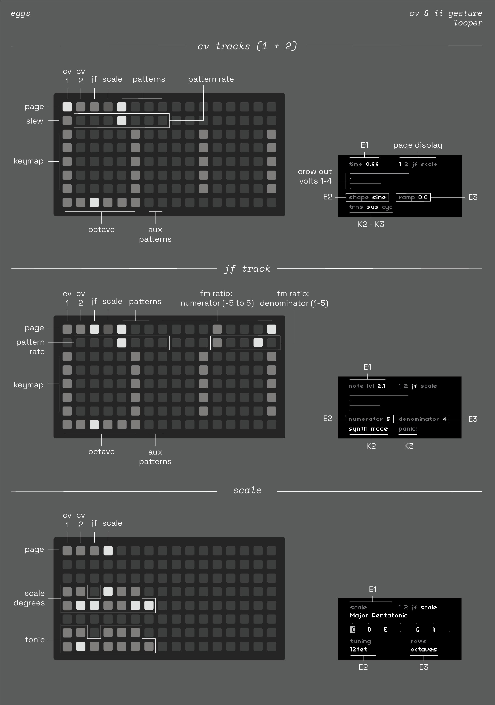
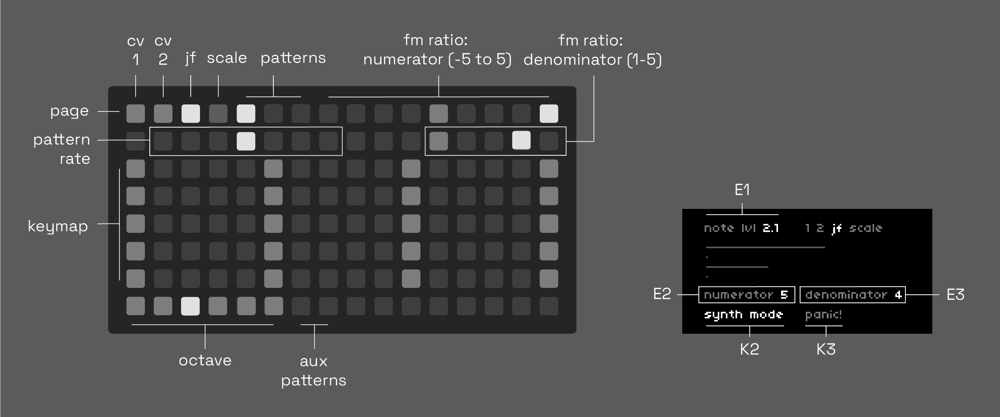
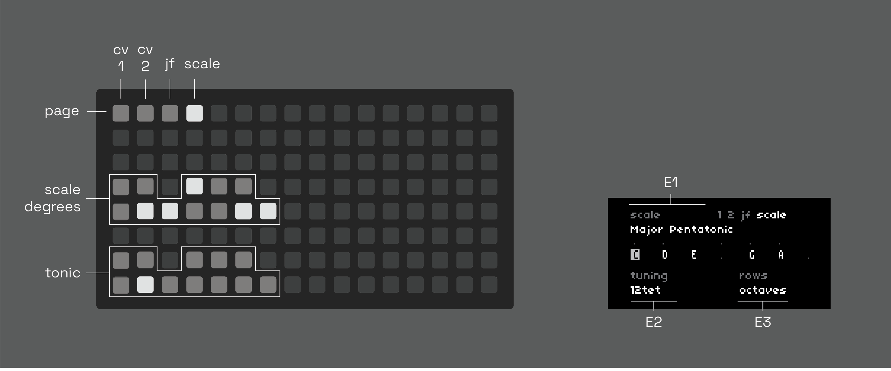

# eggs (beta)

cv & ii gesture looper for norns, grid, crow, jf.

three track grid keyboard with pattern recording, slew, & built-in ASR envelopes for crow.

## hardware

**required**

- [norns](https://github.com/p3r7/awesome-monome-norns) (220321 or later)
- [grid](https://monome.org/docs/grid/) (128, 64, or midigrid)
- [crow](https://monome.org/docs/crow/)

**also supported**

- just friends

## install

in the maiden REPL, type `;install https://github.com/andr-ew/eggs`

## documentation

use the **page** component on the top left of the grid to switch pages. there are four pages:
- **1:** crow outputs 1 + 2 (cv + env)
- **2:** crow outputs 3 + 4 (cv + env)
- **jf:** just friends (synth mode, polyphonic)
- **scale:** scale & tuning options for all tracks

### cv page (1 & 2)

### jf page

### scale page

